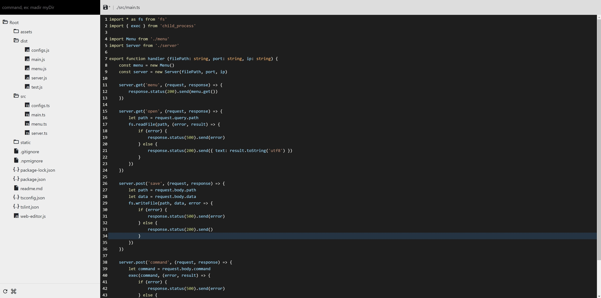

# Web Editor

Web Editor is CLI tool that browser as an editor to help you get good experience in development environment such as a raspberry.

一個利用瀏覽器作為編輯器的輕便型NODEJS的CLI工具，協助你在艱苦困住的開發環境（如：開發板）中擁有較為良好的開發體驗。

## Install

```bash
npm install web-browser-editor -g
```

## How To USE

```bash
cd "to your source folder."
wb-editor [port] [ip]
```

> Default port is 3000 and ip is localhost.

## Screenshot


